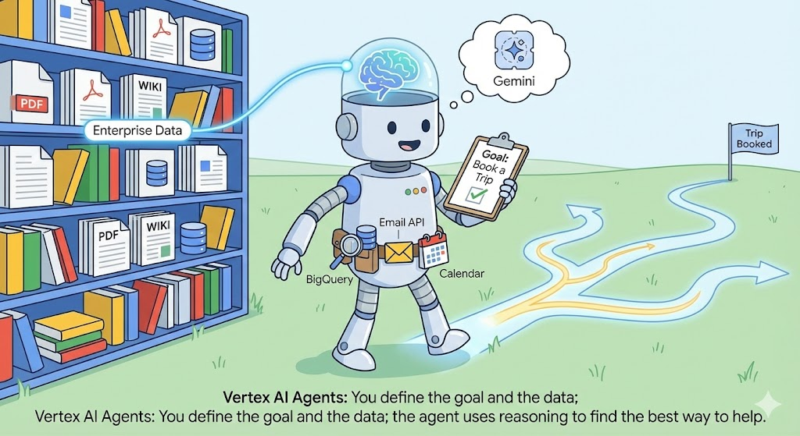
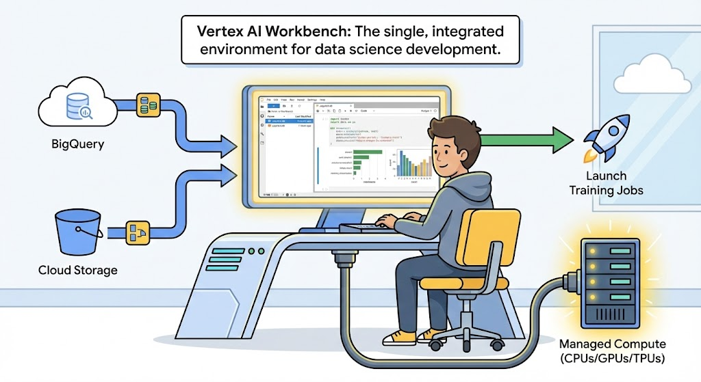
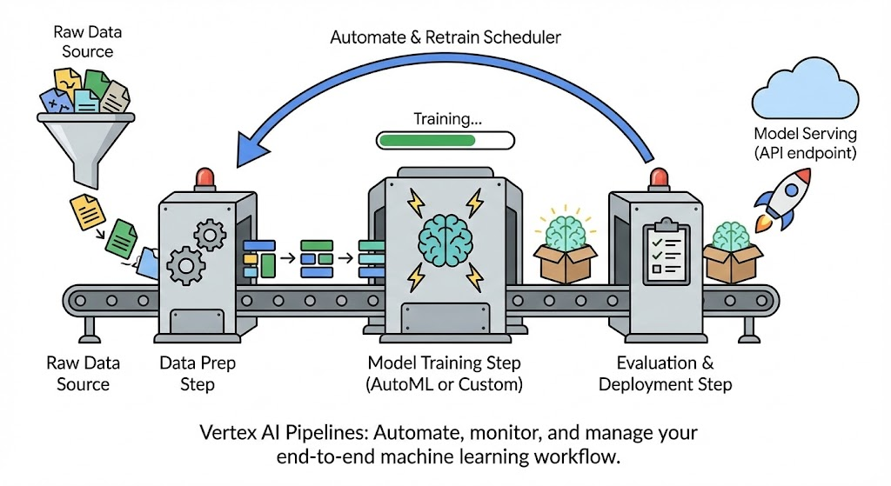
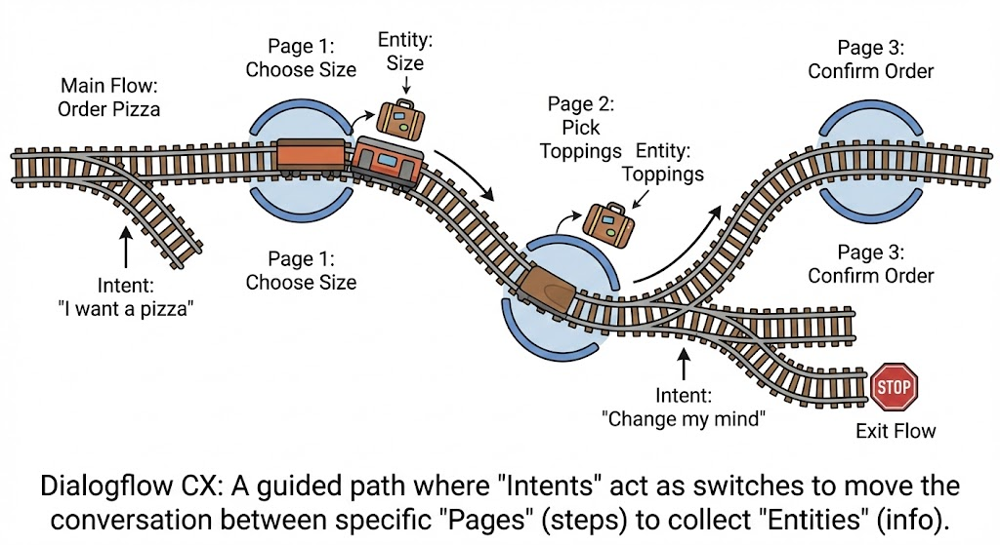

# 🚀 Google Cloud Vertex AI

Welcome to the beginner-friendly guide for navigating the Google Cloud Vertex AI ecosystem. This repository helps new users understand which product to use for their specific artificial intelligence and machine learning needs. Often people confused which product to use and what is the difference between the products within the vertex AI and different use cases. Hence I am preparing this guide to understand the difference between the product and simple word describtions.

## Vertex AI Studio

This one build for playground  to test the models like Gemini without writing any code itself. Mainly for trying out ideas for the product to check if that works for user use case. The UI looks like a simple prompt section and config section on the right to adjust the temperature to customize the reply.

## Vertex AI Agent Builder

Create agent based on the documents we want it to access, for an example a chat bot or IVR system that can only access company documents and database to answer queries. This not only access the files and access the sites, it can also book the appointments based on the requests. Best use case would be creating a customer service chatbot or an internal research assistant that knows your private business data.

Vertex AI Agent Builder help developers build, scale, and govern AI agents in production.

Below is the key parts of the agent builder: 

1. **Build: The "Creative" Phase -** This stage is about designing how your agent thinks and acts.

- Agent Development Kit (ADK): The core open-source framework for building and controlling multi-agent systems.
- Agent Garden: A "library" of pre-built solutions. You can grab Agents (full end-to-end solutions like a customer service bot) or Tools (individual skills like database access) to speed up development.
- Agent Designer: A low-code visual tool where you can prototype and test your agent's logic before you start writing heavy code.

2. **Scale: The "Factory" Phase -** Once your agent works, you need to make it professional and reliable.

- Vertex AI Agent Engine: The "brain" that runs your agent. It handles the "boring but hard" stuff like memory, session management, and code execution.
- Agent Tools: These are the "power-ups" you give your agent, including:
  - Grounding: Connecting the AI to Google Search or your own data (Vertex AI Search) so it doesn't "hallucinate."
  - Connectors: Allowing the agent to talk to 100+ apps (like Salesforce or Gmail) or your own private APIs.
  - Ecosystem Support: Integration with popular AI frameworks like LangChain and Model Context Protocol (MCP).

3. **Govern: The "Security" Phase -** This ensures your agents are safe, compliant, and visible.

- Observability: Full integration with Google Cloud Logging and Monitoring so you can see exactly what the agent is doing at all times.
- Security Command Center: Specifically detects threats or attacks against your deployed agents.
- Identity & Access (IAM): Uses standard Google security to control exactly who (or what) your agent is allowed to talk to.

Learn more about the agent builder [here](https://docs.cloud.google.com/agent-builder/overview)

## Vertex AI Search

This provides the same kind of google search like capacity to access the company's internal resources and use those resources. Think of this as "Google Search for your company." The user can give it the website URL or a folder of PDFs, and it builds a search bar for you. No difficult coding config required. 

This Vertex AI custom search can extend to the following capacity:

- Media search and recommendations
- Vertex AI Search for commerce
- Healthcare search checklist

More details about the Vertex AI search is [here](https://docs.cloud.google.com/generative-ai-app-builder/docs/about-generic-search)

The key capabilities of Vertex AI Search are as follows:

- High-quality search: Leverages Google's search expertise to understand user intent, even with complex queries and natural language queries. It combines keyword and semantic search to serve the best results.
- Personalized browse: Provides personalized results without a specific search query and personalized feed based on a user's context and navigation patterns. It is ideal for discovery experiences to view personalized category pages and home feeds.
- Data sources: Works with the following variety of data sources:
  - Website: Index your public websites and use advanced features, such as index enrichment with the structured data in your websites.
  - Structured Data: Search over data organized in a defined format, such as databases, JSON files in Cloud Storage, or BigQuery tables—for example, hotel catalogs, real estate listings, and restaurant directories.
  - Unstructured Data: Search over documents like PDFs, HTML files, and TXT files or image files like JPEG and PNG files that are stored in Cloud Storage or BigQuery.
  - Blended Search: Search over multiple data stores that blend data from the data sources mentioned above. For example, you can create a search app and connect it to a website data store and a document data store. This lets your users search over all of your content at once.
- Grounded AI answer generation: Generates AI answers grounded in your data, with citations to the source documents. You can also ask follow up questions and related queries.
- Personalization: Improves results and ranking over time by learning from user interactions captured in user events, such as clicks and conversions.
- Customization: Offers several ways to tune and configure the search and browse experience fit for your business needs.

## Model Garden on Vertex AI

A library of 150+ ready-to-use models. It’s like an app store for AI. This garden contains Google's models (Gemini), open-source ones (Llama), or specialized ones for medicine or coding.

## Vertex AI Workbench

This part of the Vertex AI used for coding in the environment like Jupyter Notebook. This build in environment allows the users to code for Data Science to transform the data and prepare for the model input. Best use case would be for someone who know codes and wants to clean data for their specific projects to build custom models. 

While Vertex AI Workbench and Google Colab are both based on Jupyter Notebooks, they serve very different purposes. If Workbench is the "Lab" for industrial-grade science, Colab is the "Sandbox" for quick sketches and community sharing.

Practice Vertex AI Workbench [notebook tutorials](https://docs.cloud.google.com/vertex-ai/docs/workbench/notebooks) to learn more about how notebook works.

## Vertex AI Pipelines

Vertex AI pipelines is that conveyor belt for Machine Learning. If the user build the model manually, it allows users to connect different tasks—like "Get Data," "Train Model," and "Deploy Model"—into one automated workflow. The pipeline work anatomy would be 

> Data Ingestion $\rightarrow$ Transformation $\rightarrow$ Training $\rightarrow$ Evaluation $\rightarrow$ Deployment (model registry $\rightarrow$ endpoints)

Vertex AI Pipelines can run pipelines built using any of the following SDKs:

- Kubeflow Pipelines SDK
- TensorFlow Extended

We can learn more about how to [create](https://docs.cloud.google.com/vertex-ai/docs/pipelines/build-pipeline#started) and [run](https://docs.cloud.google.com/vertex-ai/docs/pipelines/run-pipeline) a pipeline. 

Also user can also use the [Kubeflow Pipelines (KFP) templates](https://docs.cloud.google.com/vertex-ai/docs/pipelines/create-pipeline-template) to create the pipeline in a more easy ways. 

Note: Vertex AI also provide a managed training service that helps you operationalize large scale model training. Learn more [here](https://docs.cloud.google.com/vertex-ai/docs/training/overview?_gl=1*8f2np4*_ga*MTE4NTIwMDUzMC4xNzU3MzQzMjAz*_ga_WH2QY8WWF5*czE3NzE4MDY0NjQkbzE2JGcxJHQxNzcxODEwNDkxJGo0JGwwJGgw#workflow-serverless-training)

## Dialogflow CX

## Vertex AI Vector Search

There is an important concept to clarify, "Vector Search". This is the "engine" under the hood. It uses complex math to find "similar" things (like finding a photo of a cat because it's "mathematically similar" to a photo of a kitten). You only use this if you are a developer building a custom system. Consider this as a high-performance database designed to store and search through "vectors" (mathematical representations of data). Since it build for the "PRO" developer, the user has to do all the heavy lifting. The user must also manually turn your text/images into vectors (embeddings), manage the database, and write the code to retrieve them. The AI convert everything into vector to characterize the product.

## 🔍 Deep Dive: Understanding "Vectors"

Search in Vertex AI relies on the concept of **Vector Search**. Imagine you want to describe a fruit to a computer using only two numbers: Sweetness and Crunchiness.

**The Fruit Analogy:**

Imagine describing a fruit using only two numbers: **Sweetness** and **Crunchiness**.
* 🍎 **Apple**: Sweetness (8), Crunchiness (9) $\rightarrow$ Vector: `[8, 9]`
* 🍌 **Banana**: Sweetness (7), Crunchiness (1) $\rightarrow$ Vector: `[7, 1]`
* 🍐 **Pear**: Sweetness (7), Crunchiness (6) $\rightarrow$ Vector: `[7, 6]`

If we plot these on a graph, the Apple and the Pear will be physically closer to each other than to the Banana. In AI, this "closeness" on a graph means the objects are semantically similar. But this is a very simple example to understand the vector concept. Like this, all works and text input converted into the vector representation. 

Similarly below is the just an example of words representing as vector:
* **Word:** "Hello" $\rightarrow$ `[0.1, -0.2, 0.5]` 
* **Image:** Sunset $\rightarrow$ `[0.9, 0.1, -0.4]`
